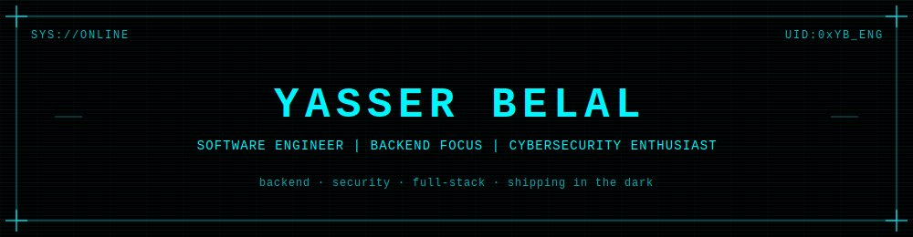

<div align="center">



<br/>

[](https://git.io/typing-svg)

</div>

<br>

### `$ neofetch` — System Information

```
     ___________         NAUTILUS_OS@yasser
    |  ._____.  |        ------------------
    |  |     |  |        OS: Nautilus_OS v2.5 [stealth-build]
    |  |     |  |        Host: Zagazig University — Faculty of Computers & Informatics
    |  |_____|  |        Kernel: Product-Engineering-Core 3.1
    |___________|        Uptime: 3rd year, still compiling
     \_________/         Role: Head of Engineering @ early-stage startup [classified]
                          Shell: node + bash, security-first mindset
                          Languages: JavaScript, Python, C++, PHP
                          Focus: backend · DevOps · deployment · testing
                          Security: network fundamentals → ethical hacking → AI system defense
                          Achievement: #8/122 — Egypt Hackathon 4th Edition (Forward AI)
```

<br>

### `$ lsmod` — Loaded Modules

<div align="center">


<br/>


</div>

<br>

### `$ ps aux` — Active Processes

```
PID   PROCESS                          STATUS
001   backend_architecture.service     [RUNNING]
002   security_hardening.service       [RUNNING]
003   stealth_startup.service          [RUNNING]   details: classified
004   ai_defense_research.service      [RUNNING]
005   hackathon_pipeline.service       [IDLE]
```

<br>

### `$ tail -f /var/log/security.log`

```
> not just prompt injection — the full defense picture:

  • prompt guardrails
  • output filtering + moderation
  • sandboxing + tool isolation
  • constitutional AI
  • adversarial training
```

<br>

### `$ netstat --nodes` — Network Nodes

<div align="center">

[](https://www.linkedin.com/in/yasser-belal/)
[](https://github.com/Yasser-Nautilus)
[](https://codeforces.com/profile/Yaser_PoltX)
[](https://t.me/Yasser_PoltX)
<br/>
[](https://tryhackme.com/p/Yasser.PoltX)
[](https://x.com/Yasser_PoltX)
[](mailto:yasserbelal2005@gmail.com)

</div>

<br>

### `$ diagnostics --run` — System Diagnostics

<div align="center">


</div>

<br>

### `$ watch -n1 network_activity` — Network Activity Monitor

<div align="center">


</div>

<br>

<div align="center">

<a href="https://open.spotify.com/user/31dawh7ffdmt7y5d6oww4qzbfghe">
  
</a>

</div>

<br>

<div align="center">

<sub>SESSION ACTIVE — CONNECTION SECURE — NAUTILUS_OS v2.5</sub>

</div>

